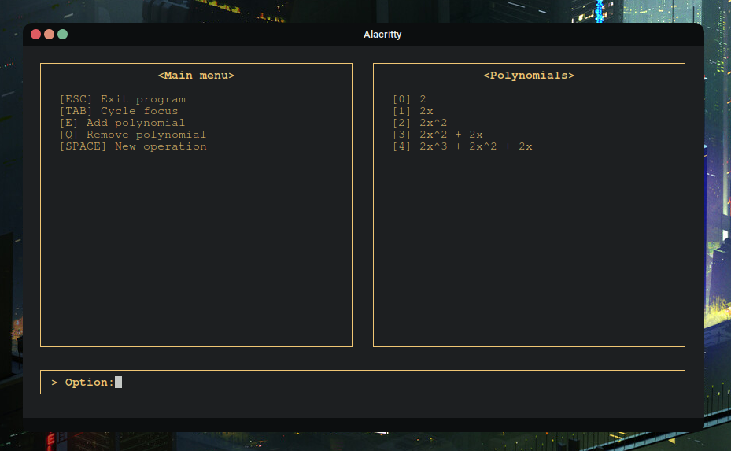

<h1 align="center">C++ Equation Math Library</h1>

    

Library for representing and operating abstract algebraic concepts

<h2 align="center">Introdution</h2>

This is a project that aims to provide some wrapper classes for algebraic mathematical concepts. At the moment it includes the Monomial and Polynomial classes for general calculus. The library is currently in expansion. Any feedback is much appreciated!

<h2 align="center">Terminal Client</h2>

The library comes with a Terminal client for Linux and Windows capable of using the header files to do some operations with polynomials, capable even to draw them in the Cartesian plane! More informartion regarding the terminal client is found at the docs.

<h2 align="center">Screenshots</h2>

Main menu

    

Operation menu

    

Root finding operation

    

Cartesian plane representation

    

<h2 align="center">Documentation</h2>

https://thewisker.github.io/EMath

<h2 align="center">Author</h2>

    </img>

<h4 align="center">TheWisker</h4>